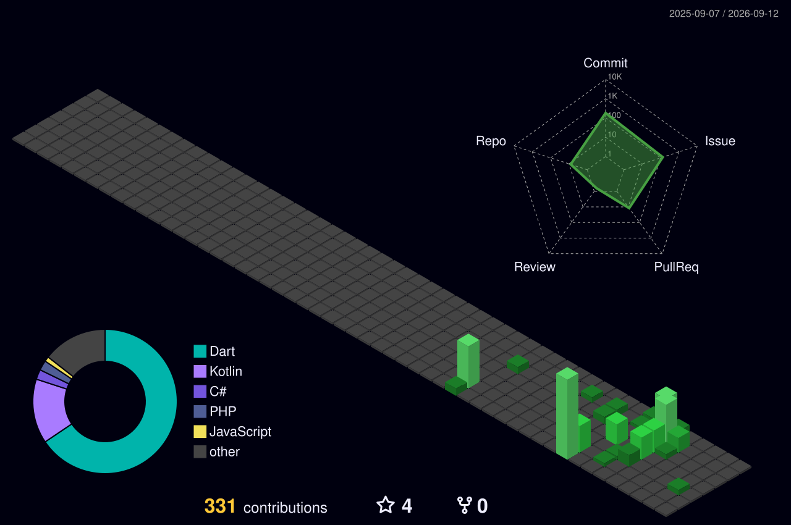

<!--
  GitHub Profile README for https://github.com/preshan
  Dark theme · navy accents · hiring-manager friendly
-->

  

  

  
  
  
  

---

### Hi, I'm Preshan

Senior Software Engineer with **8+ years** building production full stack systems for Australian product companies.

Most recently delivered Laravel and PHP APIs and document services for **Euka Future Learning** (K-12 EdTech), and shipped Flutter apps with GitHub Actions CI/CD and AWS. Earlier, as Senior Software Engineer and Team Lead at **CreatIT**, full stack delivery for **Orivet Genetic Pet Care**.

- Based in **Galle, Sri Lanka** · available **Remote AU**
- Focus: backend APIs, platform engineering, Flutter, AI-assisted delivery
- Open to senior / platform roles with Australian product teams

---

### Currently

- Shipping Flutter products with Riverpod, Supabase / Firebase, and GitHub Actions
- AI driven engineering with **Cursor**, **Claude**, **Codex**, and MCP tooling
- Hardening PHP commerce and EdTech APIs (Auth0, Nova, Pest, AWS Lambda)

---

### Featured work

| Project | Stack | What it is |
| --- | --- | --- |
| [**SYU Sri Lanka**](https://github.com/preshan/SYU-Sri-Lanka) | Flutter · Riverpod · Supabase · GitHub Actions | Membership app + site — AI driven delivery in ~4 days, 10 releases, CI/CD to [GitHub Pages](https://preshan.github.io/SYU-Sri-Lanka/) |
| [**SkyTask**](https://github.com/preshan/SkyTask) | Flutter · Clean Architecture · Isar · Firebase | Offline first productivity app — tasks, reminders, biometric lock, cloud sync |
| [**Marketplace demo**](https://github.com/preshan/laravel-Nextjs-stripe-fedex-marketplace-demo) | Laravel · Next.js · Stripe · FedEx | Commerce sample with payments and shipping integrations |
| [**School app**](https://github.com/preshan/school-app-laravel-react-) | Laravel · React | Full stack school / admin style application |

<b>Career highlights</b> (click to expand)

 

- **Euka Future Learning** — Senior Software Engineer — Laravel / PHP APIs, government registration, reporting, certificates, Python AWS Lambda PDF services, Pest (~70% coverage)
- **Etalon Australia** — Platform Engineer, AI driven full stack — commerce API hardening, webhooks, safer production changes
- **CreatIT Solutions** — Senior Software Engineer / Team Lead — Orivet Genetic Pet Care (AU DNA pet health platform): APIs, partner dashboards, Shopify sync, Stripe / PayPal, AWS CDK Lambdas, Vue → React / Next.js
- **Eutech Cybernetics** — Associate Software Engineer — enterprise XML based framework, SQL Server, Crystal Reports

---

### Skills

**Backend**  
PHP 8.x · Laravel 5.2 to 13 · REST APIs · MySQL · PostgreSQL · Nova · Passport · Auth0 · queues · caching · Pest PHP · Laravel Telescope · Python (Django, FastAPI) · AWS Lambda

**Frontend & Mobile**  
React · TypeScript · Next.js · Vue.js · Flutter · Dart · Riverpod · Isar · Supabase · Firebase Auth

**Cloud & CI/CD**  
AWS (EC2, RDS, S3, Lambda, CDK, CloudFront) · Docker · GitHub Actions · GitHub Pages · Flutter web deploy

**Integrations**  
Stripe · PayPal · Shopify · Chargebee · Australia Post · FedEx · webhooks · DataDog · Google Analytics · Google Tag Manager

**AI Skills**  
AI driven engineering with Codex · Claude · Cursor AI · MCP build skills · AI driven project planning and management

---

### My favorite tools and technologies

  

  
  
  
  
  
  
  
  

---

### GitHub stats

  
  

  

### Contribution graph

  

---

### Connect

- LinkedIn: [linkedin.com/in/preshan](https://linkedin.com/in/preshan)
- Email: [preshanpradeepa@gmail.com](mailto:preshanpradeepa@gmail.com)
- Portfolio apps: [SYU](https://preshan.github.io/SYU-Sri-Lanka/) · [SkyTask](https://github.com/preshan/SkyTask)

  

  

<!-- profile sync 20260726143413 -->
